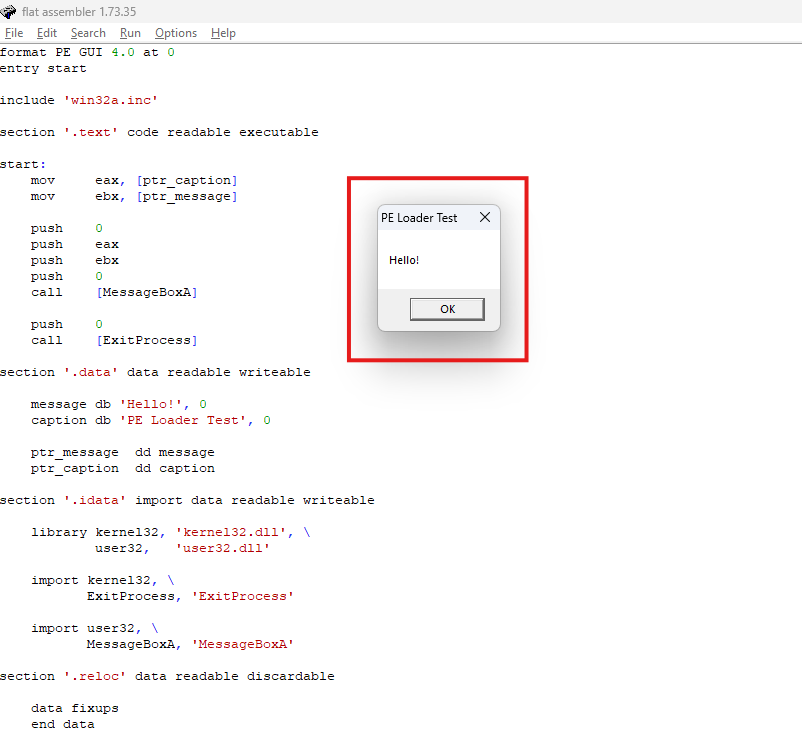
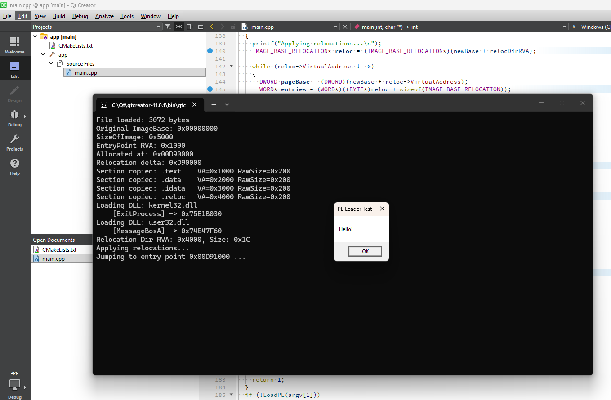
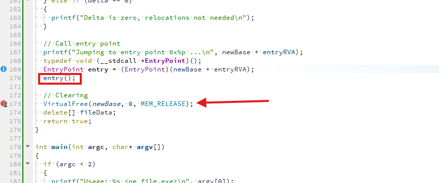

# Решение задачи на создание загрузчика для простейшего Portable Executable

1. Создана целевая программа на fasm с выводом диалогового сообщения "Hello!". Были проблемы с созданием таблицы релокаций: по умолчанию fasm ее не генерирует. Пришлось прописать явно. На скриншоте ниже пример запуска программы из среды.

2. Создан код загрузчика на C++. По сути, читаем байты exe-файла, маппим их на память, обрабатываем релокации и вызываем точку входа. На скриншоте ниже пример запуска программы.

3. Интересно, что код после вызова точки входа никогда не вызывается (Clearing). То есть выход из "дочерней" программы тригерит выход и основной. Это происходит из-за того, что "дочерняя" программа выполняется в том же адресном пространстве - процесс один. А значит и выход из процесса будет общий.

