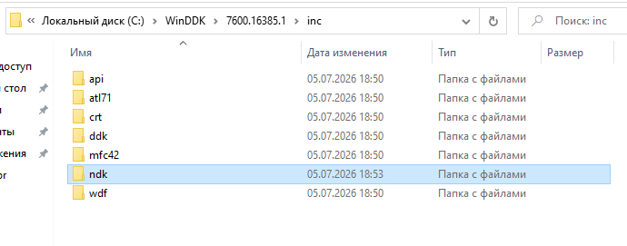
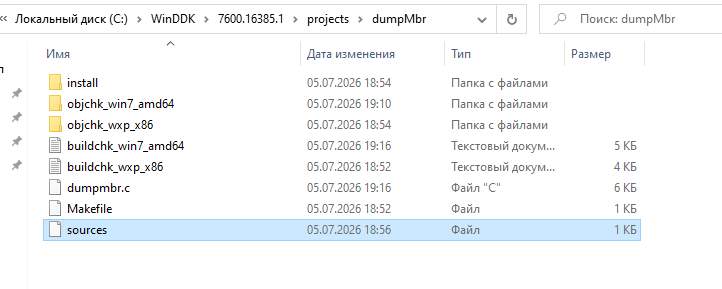
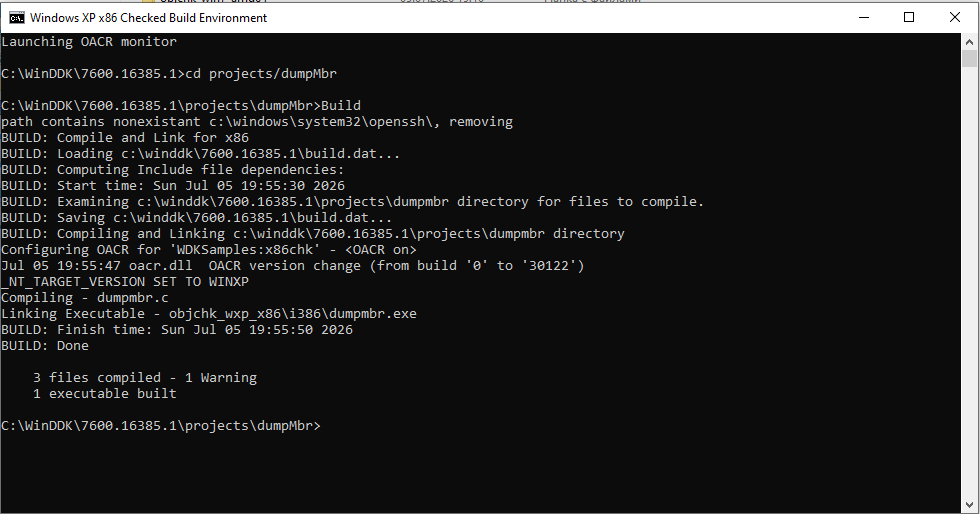
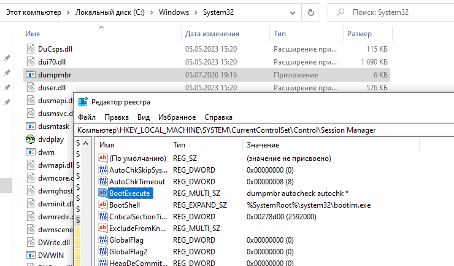
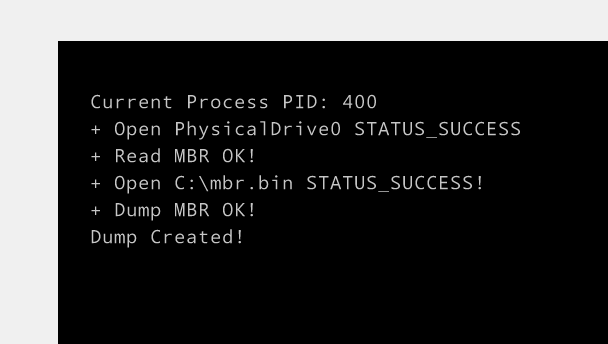
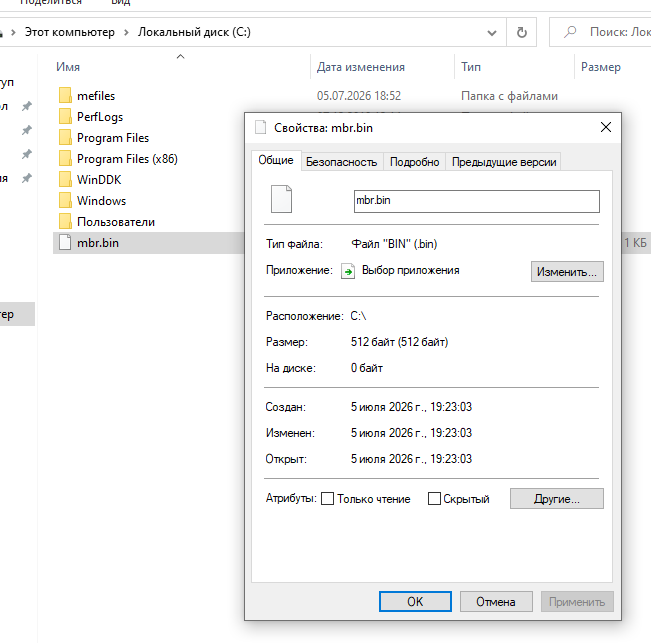

# Решение задания по сборке и запуску Native-приложения

1. На чистую ВМ установил WDK от Win 7 и докинул туда заголовочники ndk:

2. Скопировал шаблонное приложение mbrdump в папку projects и скорректировал пути для Makefile:

3. Дописал в шаблонное приложение функцию для вывода PID-а текущего процесса. Задействована функция `NtQueryInformationProcess`.

4. Собрал приложение из консоли WDK "x64 Checked Build Environment". Успешно собиралось как командой `Build`, так и `nmake`:

5. Скопировал собранную программу dumpmbr в System32 и прописал ее запуск в поле реестра `BootExecute`:

6. Отправил ОС на перезагрузку.

7. Вывод программы dumpmbr при старте системы:

8. После запуска видим файл `mbr.bin` размером 512Кб (размер записи MBR) на диске С:

