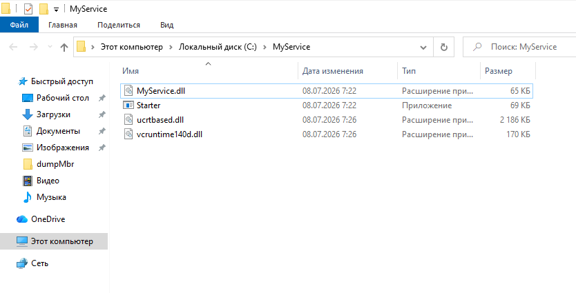
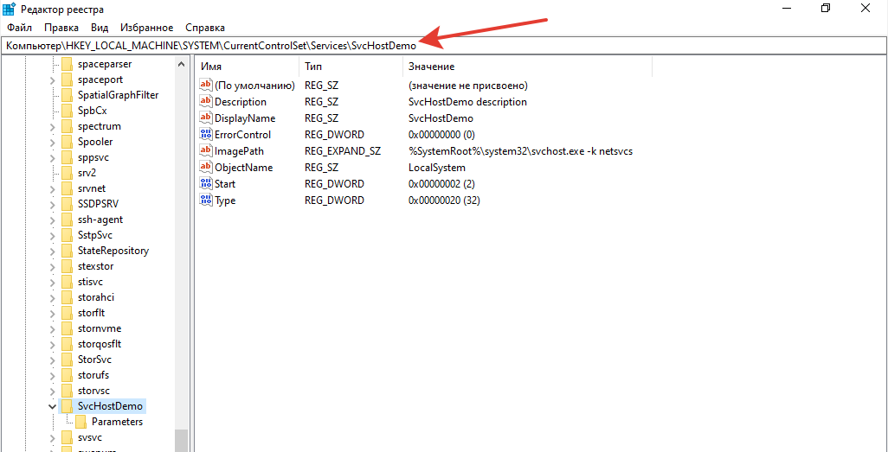
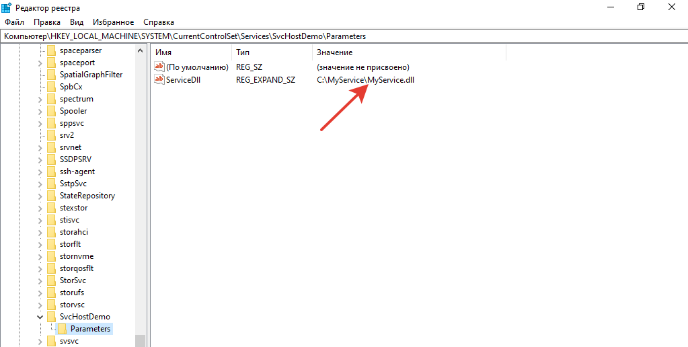
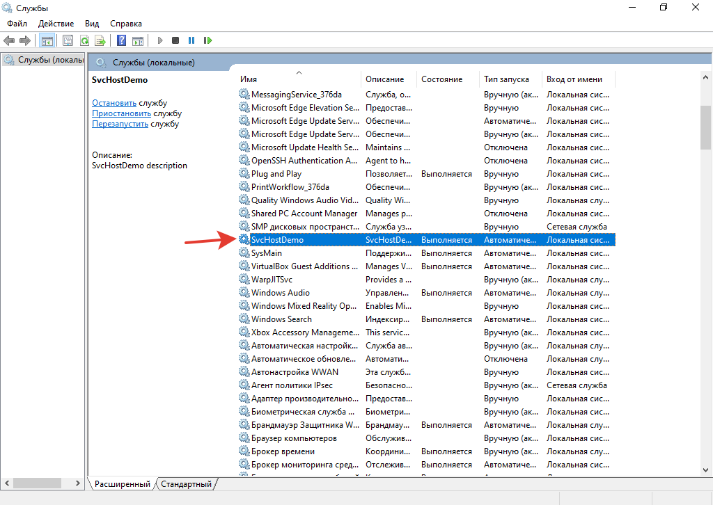
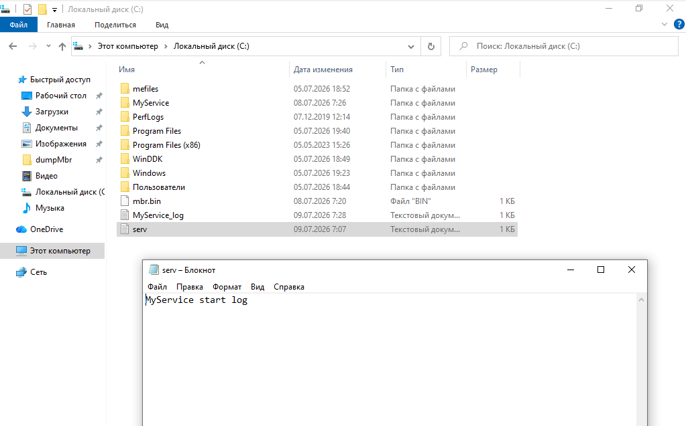
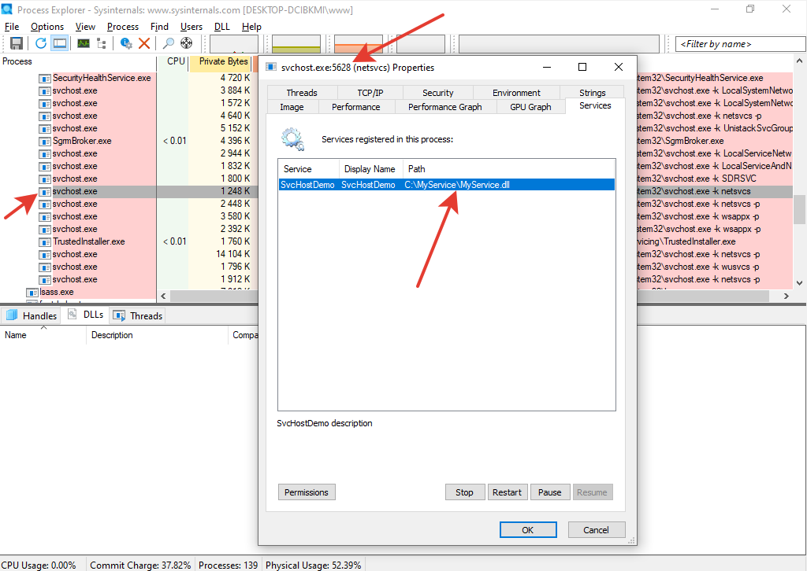
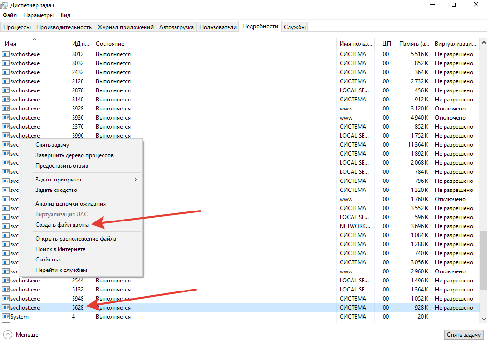
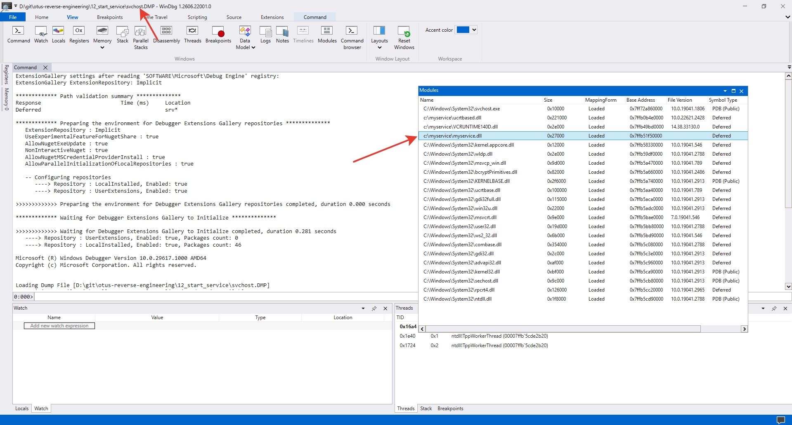

# Решение задачи по запуску службы

1. Дописал в шаблонный код сервиса функцию `WriteStartFile()`, записывающую в файл `C:\serv.log` строку `"MyService start log"` при старте службы.

2. Собрал сервис `MyService.dll` и стартер `Starter.exe` в Visual Studio и перенес бинарные файлы на ВМ. Туда же скопировал необходимый рантайм.

3. Запустил `Starter.exe`. В реестре появилась запись с новой службой.

4. В ветке реестра Parameters скорректировал путь к запускаемой dll для службы.

5. Запустил службу.

6. Проверил запись файла `C:\serv.log`. Работает. Там же видно, что пишутся логи службы в `C:\MyService_log.txt`.

7. Нашел в Process Explorer нужный svchost.exe, где загружена библиотека `MyService.dll`. Запомнил PID процесса.

8. Выгрузил дамп процесса svchost.exe в Диспетчере задач.

9. Открыл дамп в WinDbg и нашел там библиотеку MyService.dll.

