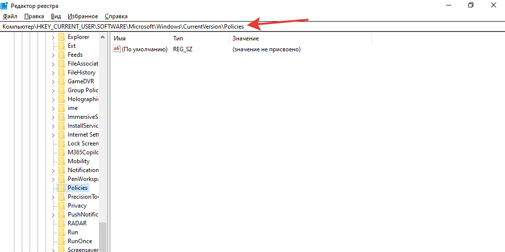
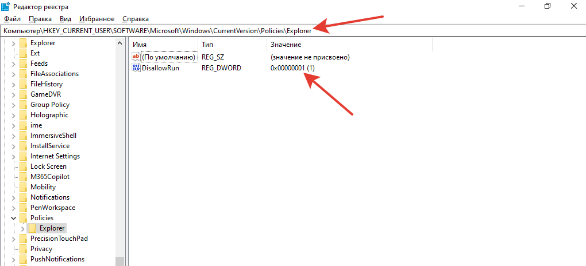
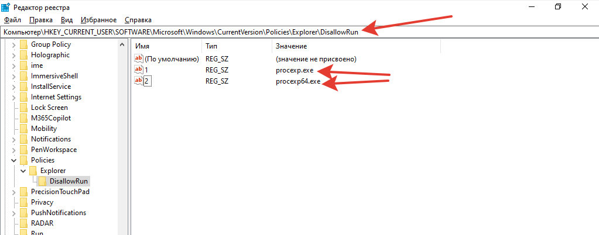
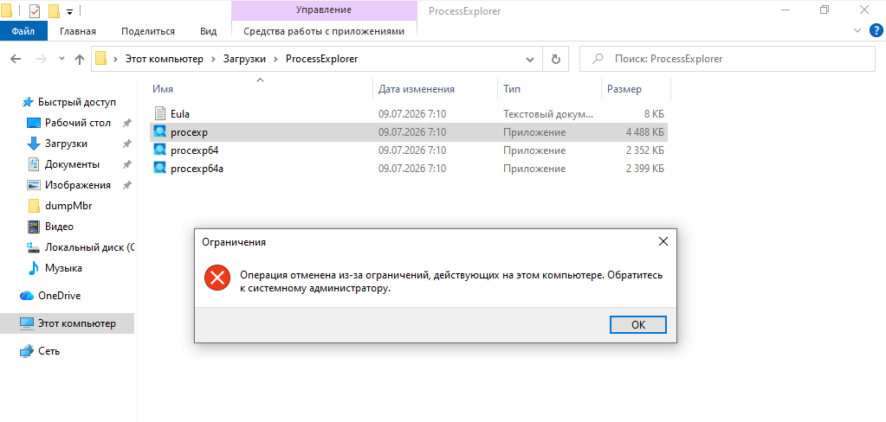

# Решение задачи по ограничению запуска приложений

1. Так как на Windows 10 Home нет инструментов настройки политик запуска, использовал реестр. Запустил `regedit` и перешел в ветку `Policies`.

2. Создал там раздел `Explorer` с переменной `DisallowRun` типа `DWORD`. Установил переменной значение `1`.

3. Создал подраздел `Explorer/DisallowRun` и прописал там две строковые переменные с именами `exe`-шников, запуск которых надо запретить. Имена параметров "1" и "2" выбраны произвольно.

4. Перезагрузил ОС.

5. Проверил запуск приложения - выскакивает окно блокировки.

