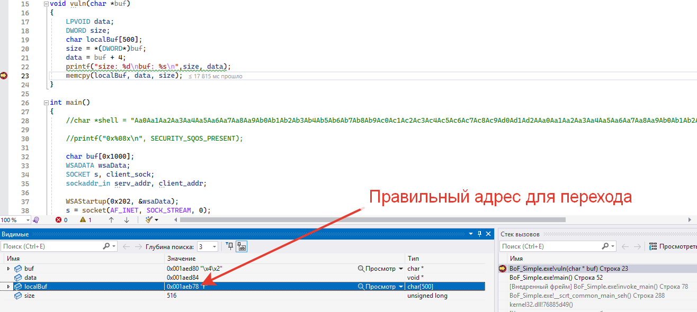
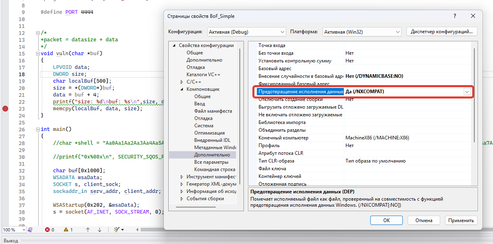
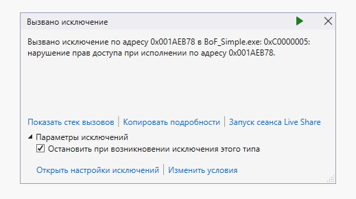
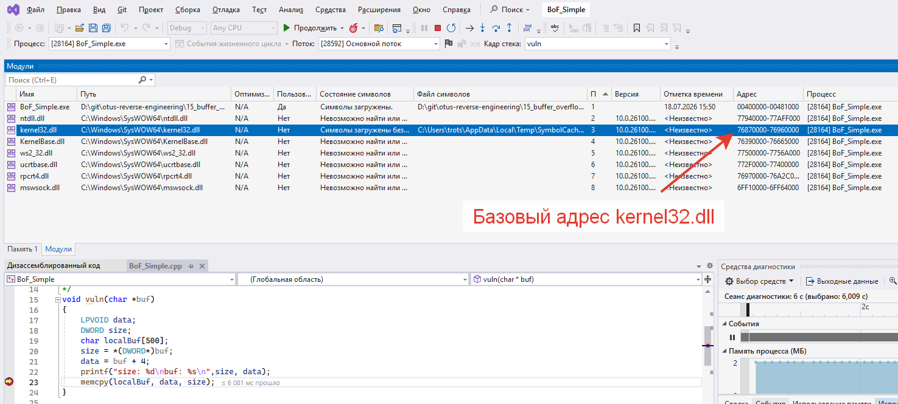
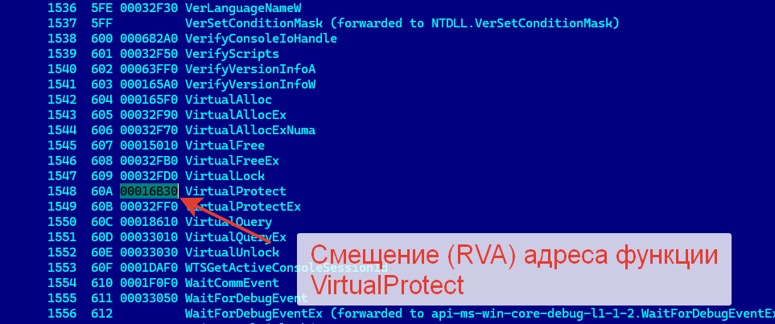
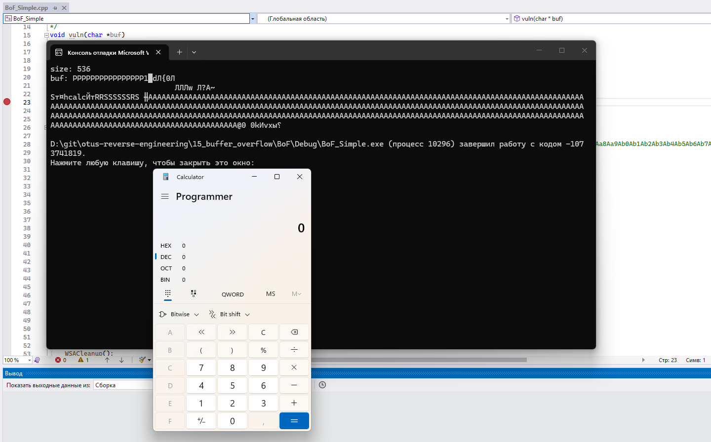

# Решение задачи по эксплуатации уязвимости Buffer Overflow (переполнение буфера)

1. Задача поставляется с шаблонным проектом `BoF_Simple` с захардкоженной уязвимостью. На моей машине исходный эксплойт (`main.py`) с ходу не сработал: программа просто падала. Для правильной работы нужно было скорректировать в `main.py` адрес буфера, на который передается управление. После коррекции калькулятор запустился.



2. В рамках домашнего задания требуется включить предотвращение выполнения данных (DEP) и попытаться обойти его с помощью `VirtualProtect`. Включаю DEP и пересобираю проект.



3. Теперь попытка запуска эксплойта заканчивается падением приложения из-за нарушения прав доступа.



4. Перед доработкой эксплойта надо найти адрес функции `VirtualProtect`. В отладчике нашел базовый адрес `kernel32.dll`: `0x76870000`. Далее через вызов `dumpbin /exports C:\Windows\SysWOW64\kernel32.dll` нашел смещение функции `VirtualProtect`: `0x00016B30`. Тогда адрес функции `VirtualProtect` равен `0x76886B30`.





5. Доработал эксплойт, добавив в него вызов функции `VirtualProtect`, который открывает права на исполнение для указанного адреса. Для этого собрал следующую ROP-цепочку и добавил ее к исходной полезной нагрузке:

```python
rop_chain = (
    addr_virtual_protect + # Адрес функции VirtualProtect
    addr_shellcode +       # Адрес возврата после вызова VirtualProtect (полезная нагрузка)
    lp_address +           # Адрес полезной нагрузки, для которого меняются права
    dw_size +              # Размер изменяемой области памяти
    fl_new_protect +       # Права доступа (PAGE_EXECUTE_READWRITE)
    lpfl_old_protect       # Адрес переменной, которая получит значение предыдущих прав (взял какое-то левое значение в этом же стеке)
)
```

6. Запустил эксплойт. Теперь калькулятор снова успешно запускается.


