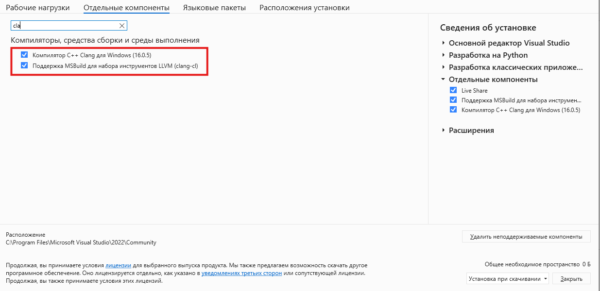
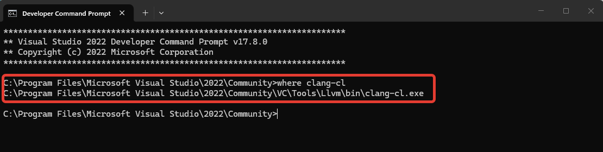
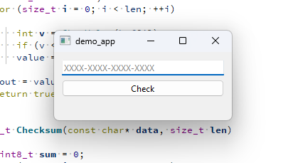
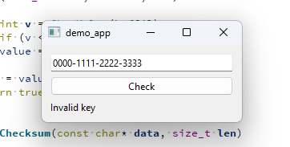
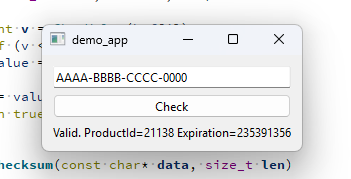
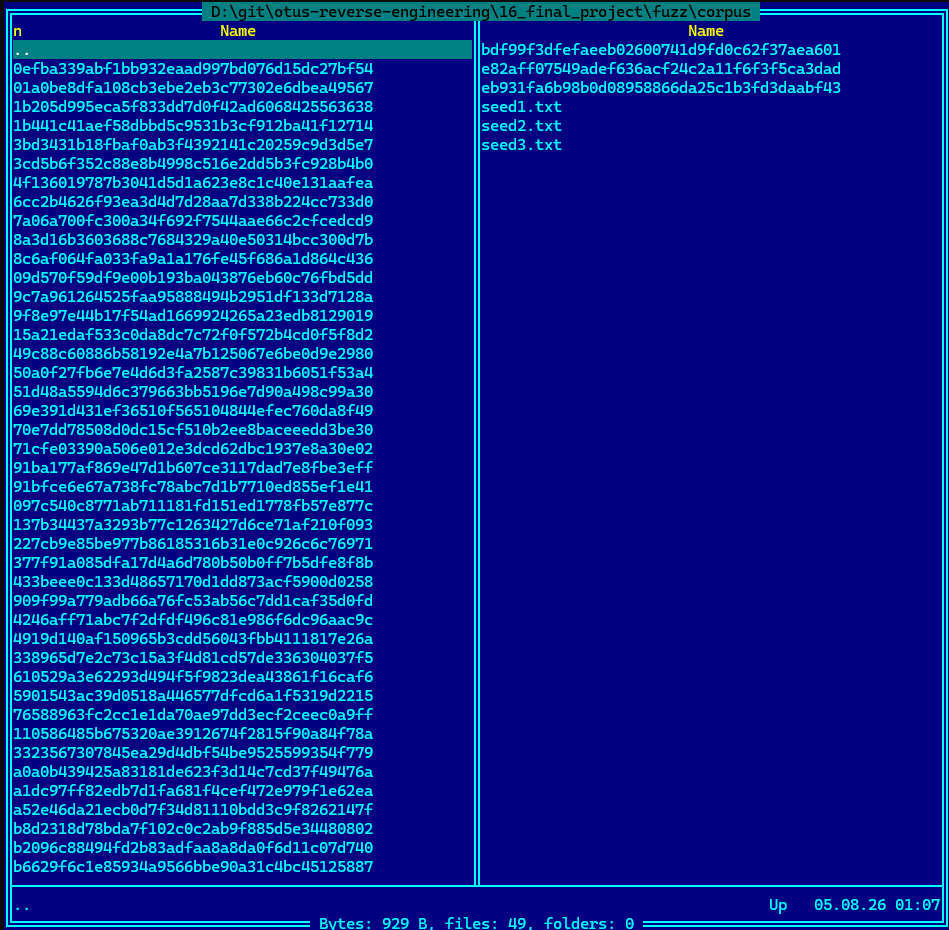
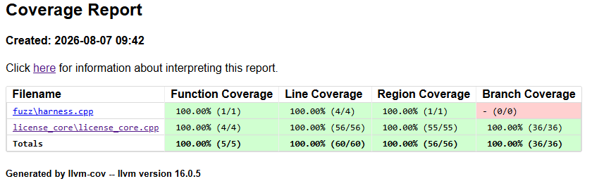
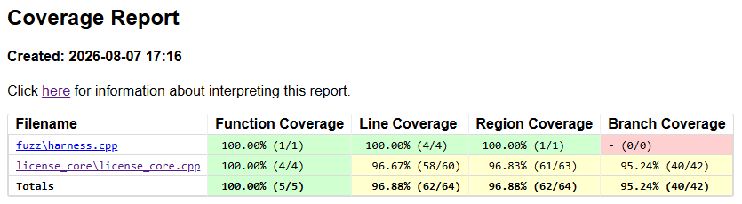
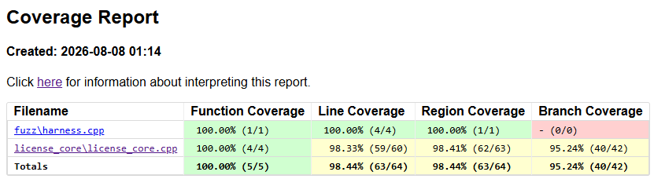
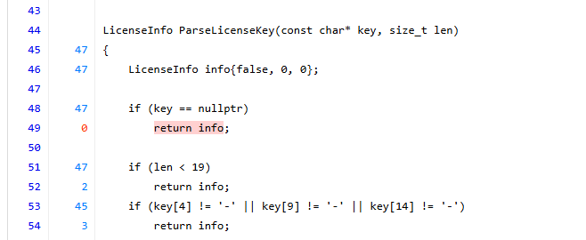

# Применение фаззинга для оценки защищённости механизма лицензирования приложения

Отчет по проектной работе.

## Цель и задачи

**Цель**: освоить механизм применения фаззинга.

**Задачи**:
- Определить стек технологий.
- Разработать тестовое приложение.
- Написать fuzz-harness для функции проверки/парсинга. Найти краши или аномалии.
- Проанализировать найденные баги.
- Предложить исправление.

## Стек технологий

- Язык программирования: `C++`
- Фреймворк: `Qt`
- Фаззер: `LLVM libFuzzer` через `clang-cl`
- IDE: `QtCreator`

## Порядок работ

### Настройка окружения

Для сборки тестового приложения использовался компилятор `MSVC`, поставляемый с `Visual Studio 2022`. Библиотека `Qt` установлена через `vcpkg`.

`LLVM libFuzzer` обеспечивается той же поставкой `Visual Studio 2022` как дополнительный компонент. В частности были установлены следующие компоненты:
- Компилятор C++ Clang
- Поддержка MSBuild для LLVM
- C++ AddressSanitizer



Через консоль разработчика проверил доступность компилятора `clang`.



### Структура проекта

В качестве тестового приложения выбрана элементарная проверка лицензионного ключа, состоящего из 4-х групп символов в формате "XXXX-XXXX-XXXX-XXXX". Первая группа - product ID, вторая и третья - дата истечения, четвёртая - контрольная сумма.

Проект состоит из трех частей:
- **Библиотека лицензирования `license_core`.** Включает функцию проверки лицензионного ключа `ParseLicenseKey()`.
- **Тестовое приложение `demo_app`.** Обеспечивает демонстрационный GUI для ввода лицензионного ключа. Зависит от `license_core`.
- **Фаззер `fuzz`.** Обеспечивает фаззинг для функции проверки ключа. Зависит от `license_core`.

Исходный код проекта приведен в соответствующих папках, размещенных рядом с этим файлом `REPORT.md`.

Фаззер состоит из одной функции `LLVMFuzzerTestOneInput()`, обеспечивающей прогон целевой функции `ParseLicenseKey()` с разным набором данных:

```cpp
extern "C" int LLVMFuzzerTestOneInput(const uint8_t* data, size_t size) {
    ParseLicenseKey(reinterpret_cast<const char*>(data), size);
    return 0;
}
```

### Сборка и запуск проекта

Библиотека лицензирования `license_core` и тестовое приложение `demo_app` собираются с помощью `CMake` в среде `QtCreator`.

Вид приложения:



При вводе невалидного лицензионного ключа приложение показывает сообщение "Invalid key"



А при вводе валидного - "Valid. ProductId=%1 Expiration=%2".



Приложение простое и достаточное для применения фаззинга.

### Сборка фаззера

Сборка самого фаззера выполняется через консоль разработчика от `Visual Studio 2022`, так как там есть все необходимые зависимости.

Команда для сборки:
```cmd
clang-cl -O2 -fsanitize=address,fuzzer -I license_core\include fuzz\harness.cpp license_core\license_core.cpp -o fuzz\fuzz_harness.exe -fuse-ld=lld
```

Самый интересный ключ в контексте задачи - это `-fsanitize=address,fuzzer`. `address` включает `AddressSanitizer`, который ловит разные проблемы вроде утечек и выходов за пределы массива. `fuzzer` включает непосредственно механизм фаззинга, который встраивает движок фаззинга и добавляет точку входа для его запуска.

Результат сборки - приложение `fuzz_harness.exe`.

### Запуск фаззера

При запуске фаззер будет циклично вызывать целевую функцию `ParseLicenseKey()` с разными входными данными, которые в процессе будут подвергаться **мутациям**. Каждый вариант входных данных формирует **карту покрытия** исходного кода. Если карта текущих входных данных отличается от объединения всех предыдущих карт, то фаззер считает эти данные интересными и добавляет их в **корпус**. Корпус - это папка с файлами, содержащими значения входных данных. Один файл - одно значение. Дальнейшие мутации выполняются уже с учетом данных корпуса (энтропийное распределение по весу каждого корпусного файла). Это называется **coverage-guided** фаззинг.

Чтобы фаззер слишком долго не угадывал данные, улучшающие покрытие, можно сразу подсказать ему формат. Так корпус не будет расти случайно. Для этого перед запуском фаззера требуется создать несколько корпусных файлов (сидов), которые будут служить для него отправной точкой в генерации вариантов:
- `corpus/seed1.txt` с текстом `AB3F-9K2L-0X7Q-CH01 `
- `corpus/seed2.txt` с текстом `0000-0000-0000-0000 `
- `corpus/seed3.txt` с текстом `ZZZZ-ZZZZ-ZZZZ-ZZZZ `

При запуске фаззера папка `corpus` передается ему в качестве аргумента:
```cmd
fuzz_harness.exe corpus
```

### Интерпретация результатов

Первый запуск фаззера завершается с интересным результатом: найдена уязвимость `stack-buffer-overflow`.

Полный лог запуска:
```cmd
D:\git\otus-reverse-engineering\16_final_project\fuzz>fuzz_harness.exe corpus
INFO: Running with entropic power schedule (0xFF, 100).
INFO: Seed: 3719745881
INFO: Loaded 1 modules   (64 inline 8-bit counters): 64 [00DC8EA8, 00DC8EE8),
INFO: Loaded 1 PC tables (64 PCs): 64 [00DBBCC8,00DBBEC8),
INFO:        3 files found in corpus
INFO: -max_len is not provided; libFuzzer will not generate inputs larger than 4096 bytes
INFO: seed corpus: files: 3 min: 22b max: 22b total: 66b rss: 41Mb
=================================================================
==24708==ERROR: AddressSanitizer: stack-buffer-overflow on address 0x00aff175 at pc 0x00cdb9b6 bp 0x00aff14c sp 0x00afed1c
WRITE of size 7 at 0x00aff175 thread T0
    #0 0xcdb9b5 in __asan_memcpy C:\src\llvm_package_16.0.5\llvm-project\compiler-rt\lib\asan\asan_interceptors_memintrinsics.cpp:22
    #1 0xd0b629 in ParseLicenseKey(char const *, unsigned int) (D:\git\otus-reverse-engineering\16_final_project\fuzz\fuzz_harness.exe+0x48b629)
    #2 0xd0b42f in ParseLicenseKey(char const *, unsigned int) (D:\git\otus-reverse-engineering\16_final_project\fuzz\fuzz_harness.exe+0x48b42f)
    #3 0xd0ab54 in LLVMFuzzerTestOneInput (D:\git\otus-reverse-engineering\16_final_project\fuzz\fuzz_harness.exe+0x48ab54)
    #4 0xca9f31 in fuzzer::Fuzzer::RunOne(unsigned char const *, unsigned int, bool, struct fuzzer::InputInfo *, bool, bool *) C:\src\llvm_package_16.0.5\llvm-project\compiler-rt\lib\fuzzer\FuzzerLoop.cpp:519
    #5 0xcabf2e in fuzzer::Fuzzer::ReadAndExecuteSeedCorpora(class std::vector<struct fuzzer::SizedFile, class std::allocator<struct fuzzer::SizedFile>> &) C:\src\llvm_package_16.0.5\llvm-project\compiler-rt\lib\fuzzer\FuzzerLoop.cpp:832
    #6 0xcac2d1 in fuzzer::Fuzzer::Loop(class std::vector<struct fuzzer::SizedFile, class std::allocator<struct fuzzer::SizedFile>> &) C:\src\llvm_package_16.0.5\llvm-project\compiler-rt\lib\fuzzer\FuzzerLoop.cpp:870
    #7 0xc969bb in fuzzer::FuzzerDriver(int *, char ***, int (__cdecl *)(unsigned char const *, unsigned int)) C:\src\llvm_package_16.0.5\llvm-project\compiler-rt\lib\fuzzer\FuzzerDriver.cpp:912
    #8 0xcc3e14 in main C:\src\llvm_package_16.0.5\llvm-project\compiler-rt\lib\fuzzer\FuzzerMain.cpp:20
    #9 0xd2f215 in invoke_main D:\a\_work\1\s\src\vctools\crt\vcstartup\src\startup\exe_common.inl:78
    #10 0xd2f215 in _scrt_common_main_seh D:\a\_work\1\s\src\vctools\crt\vcstartup\src\startup\exe_common.inl:288
    #11 0x76885d48  (C:\WINDOWS\System32\KERNEL32.DLL+0x10015d48)
    #12 0x779ae00a  (C:\WINDOWS\SYSTEM32\ntdll.dll+0x4b2ee00a)                                                                                                                                              23:27
    #13 0x779adf90  (C:\WINDOWS\SYSTEM32\ntdll.dll+0x4b2edf90)

Address 0x00aff175 is located in stack of thread T0 at offset 21 in frame
    #0 0xd0b59f in ParseLicenseKey(char const *, unsigned int) (D:\git\otus-reverse-engineering\16_final_project\fuzz\fuzz_harness.exe+0x48b59f)

  This frame has 1 object(s):
    [16, 21) 'buf' <== Memory access at offset 21 overflows this variable
HINT: this may be a false positive if your program uses some custom stack unwind mechanism, swapcontext or vfork
      (longjmp, SEH and C++ exceptions *are* supported)
SUMMARY: AddressSanitizer: stack-buffer-overflow C:\src\llvm_package_16.0.5\llvm-project\compiler-rt\lib\asan\asan_interceptors_memintrinsics.cpp:22 in __asan_memcpy
Shadow bytes around the buggy address:
  0x00afee80: 00 00 00 00 00 00 00 00 00 00 00 00 00 00 00 00
  0x00afef00: 00 00 00 00 00 00 00 00 00 00 00 00 00 00 00 00
  0x00afef80: 00 00 00 00 00 00 00 00 00 00 00 00 00 00 00 00
  0x00aff000: 00 00 00 00 00 00 00 00 00 00 00 00 00 00 00 00
  0x00aff080: 00 00 00 00 00 00 00 00 00 00 00 00 00 00 00 00
=>0x00aff100: 00 00 00 00 00 00 00 00 00 00 00 00 f1 f1[05]f3
  0x00aff180: f3 f3 00 00 00 00 00 00 00 00 00 00 00 00 00 00
  0x00aff200: 00 00 00 00 f1 f1 04 f2 04 f3 00 00 00 00 00 00
  0x00aff280: 00 00 00 00 00 00 00 00 00 00 00 00 00 00 00 00
  0x00aff300: 00 00 00 00 00 00 00 00 00 00 00 00 00 00 00 00
  0x00aff380: 00 00 00 00 00 00 00 00 00 00 00 00 00 00 00 00
Shadow byte legend (one shadow byte represents 8 application bytes):
  Addressable:           00
  Partially addressable: 01 02 03 04 05 06 07
  Heap left redzone:       fa
  Freed heap region:       fd
  Stack left redzone:      f1
  Stack mid redzone:       f2
  Stack right redzone:     f3
  Stack after return:      f5
  Stack use after scope:   f8
  Global redzone:          f9
  Global init order:       f6
  Poisoned by user:        f7
  Container overflow:      fc
  Array cookie:            ac
  Intra object redzone:    bb
  ASan internal:           fe
  Left alloca redzone:     ca
  Right alloca redzone:    cb
==24708==ABORTING
MS: 0 ; base unit: 0000000000000000000000000000000000000000
0x30,0x30,0x30,0x30,0x2d,0x30,0x30,0x30,0x30,0x2d,0x30,0x30,0x30,0x30,0x2d,0x30,0x30,0x30,0x30,0x20,0xd,0xa,
0000-0000-0000-0000 \015\012
artifact_prefix='./'; Test unit written to ./crash-349b4e4fddad65990e1a8b2cc76afa6e4e9ea020
Base64: MDAwMC0wMDAwLTAwMDAtMDAwMCANCg==
```

Также по результатам запуска сгенерирован файл `crash-349b4e4fddad65990e1a8b2cc76afa6e4e9ea020` с данными, на которых был крэш. То есть с этой строкой:
```
0000-0000-0000-0000 \015\012
```

Сложно сказать, какие именно мутации привели к этой строке. Скорее всего имела место вставка и замена байтов. При этом очевидно, что фаззер старается не трогать три дефиса "-", которые определяют структуру данных. Практически во всех файлах корпуса, которые сгенерировал фаззер во время прогона, дефисы на своих местах. И это понятно, так как удаление любого из дефисов резко уменьшает карту покрытия.

Итак, обнаружена распространенная уязвимость Buffer Overflow, которую мы разбирали на 34-м занятии курса. Обычно эксплуатируется путем переписывания адреса возврата на полезную нагрузку с ее последующим исполнением. Но если учесть, что мы имеем дело с функциональностью лицензирования, то вектор атаки здесь будет иной.

Уязвимость зафиксирована в функции `DecodeGroup()`:
```cpp
bool DecodeGroup(const char* group, size_t len, uint32_t* out)
{
    char buf[5];
    memcpy(buf, group, len); // buffer overflow
    buf[len] = '\0';

    uint32_t value = 0;
    for (size_t i = 0; i < len; ++i)
    {
        int v = CharValue(buf[i]);
        if (v < 0) return false;
        value = value * 36 + v;
    }
    *out = value;
    return true;
}
```

Теоретически, уязвимость может быть проэксплуатирована для принудительного возврата `true` из функции `DecodeGroup()`. Тогда любая группа лицензионного ключа будет определяться программой как валидная. Это открывает возможность обойти систему лицензирования даже без патчинга бинаря.

С одной стороны, можно сказать, что современные ОС обладают достаточной защитой, предупреждающей исполнение кода из секции данных. Эксплуатация такой уязвимости скорее исключена. Но с другой стороны, невозможно гарантировать, что приложение будет собрано с правильными ключами защиты, а конкретная версия ОС сможет защитить от эксплуатации. Поэтому устранение таких уязвимостей остается единственным действенным средством снижения риска.

### Исправление и повторный прогон

Уязвимость исправляется добавлением простой проверки длины массива:
```cpp
bool DecodeGroup(const char* group, size_t len, uint32_t* out)
{
    if (len ==0 || len > 4) // <<--- fix
        return false;

    char buf[5];
    memcpy(buf, group, len);
    buf[len] = '\0';
...
```

Для проверки исправления выполнен запуск фаззера с указанием конкретного краш-репорта:
```cmd
D:\git\otus-reverse-engineering\16_final_project\fuzz>fuzz_harness.exe crash-349b4e4fddad65990e1a8b2cc76afa6e4e9ea020
INFO: Running with entropic power schedule (0xFF, 100).
INFO: Seed: 778455910
INFO: Loaded 1 modules   (85 inline 8-bit counters): 85 [00EA8EA8, 00EA8EFD),
INFO: Loaded 1 PC tables (85 PCs): 85 [00E9BCC8,00E9BF70),
D:\git\otus-reverse-engineering\16_final_project\fuzz\fuzz_harness.exe: Running 1 inputs 1 time(s) each.
Running: crash-349b4e4fddad65990e1a8b2cc76afa6e4e9ea020
Executed crash-349b4e4fddad65990e1a8b2cc76afa6e4e9ea020 in 0 ms
```

Краш больше не воспроизводится.

Также выполнен повторный запуск фаззера. Процесс длился порядка 1 часа и был прерван вручную.

> В "боевых" условиях фаззеры могут работать непрерывно днями и неделями. Наблюдал такое в смежных командах разработки. Но для тестового эксперимента решено остановиться на непродолжительном запуске.

Тем не менее требуется дать оценку повторному прогону фаззера, выполнив анализ покрытия кода.

За час работы фаззер создал множество файлов-сидов в папке `corpus`, которые дополняют 3 исходных. Фаззер создает новый файл каждый раз, когда карта покрытия улучшается.



Чтобы увидеть покрытие, требуется пересобрать фаззер с включенным инструментированием:
```cmd
clang-cl -O2 -fsanitize=fuzzer,address -fprofile-instr-generate -fcoverage-mapping -I license_core\include fuzz\harness.cpp license_core\license_core.cpp -o fuzz\fuzz_harness_cov.exe -fuse-ld=lld
```

При повторном прогоне требуется запустить `fuzz_harness_cov.exe` на существующем накопленном корпусе с параметром `-runs=0`. Параметр указывает фаззеру прогнать корпус один раз без мутации данных. В результате будет получено покрытие кода для последнего прогона фаззера.
```cmd
cd fuzz
fuzz_harness_cov.exe corpus -runs=0
```

Получен вывод:
```cmd
INFO: Running with entropic power schedule (0xFF, 100).
INFO: Seed: 203213007
INFO: Loaded 1 modules   (94 inline 8-bit counters): 94 [008FEEE8, 008FEF46),
INFO: Loaded 1 PC tables (94 PCs): 94 [008F1D90,008F2080),
INFO:       49 files found in corpus
INFO: -max_len is not provided; libFuzzer will not generate inputs larger than 4096 bytes
INFO: seed corpus: files: 49 min: 1b max: 22b total: 929b rss: 43Mb
#50     INITED cov: 72 ft: 82 corp: 40/743b exec/s: 0 rss: 44Mb
#50     DONE   cov: 72 ft: 82 corp: 40/743b lim: 20 exec/s: 0 rss: 44Mb
Done 50 runs in 0 second(s)
```

Команды для генерации отчета по покрытию:
```cmd
llvm-profdata merge -sparse fuzz_harness.profraw -o fuzz_harness.profdata
llvm-cov report fuzz_harness_cov.exe -instr-profile=fuzz_harness.profdata
llvm-cov show fuzz_harness_cov.exe -instr-profile=fuzz_harness.profdata -format=html -output-dir=coverage_html
```

Отчет (подробнее см. в репозитории в папке `fuzz/coverage_html`):



Покрытие кода - 100%. Теперь можно утверждать, что накопленный корпус достаточный для выполнения задачи. Конечно, такое полное покрытие было бы очень сложно достичь, если бы не использовались заранее заданные отправные файлы корпуса (сиды). Количество вариантов, которое пришлось бы перебрать фаззеру, было бы недостижимо огромным.

## Фаззинг с помощью ИИ

### Сбор сведений

В качестве эксперимента выполнен фаззинг с помощью ИИ-инструментов. Была некоторая уверенность, что если определить ИИ на роль фаззера, то можно получить интересные результаты. Конечно, процесс скорее будет похож на статический анализ, а не фаззинг, но позиционирование ИИ на роль фаззера действительно может направить его логику в сторону поиска уязвимостей.

Проведен анализ с помощью Claude (Sonnet 5), DeepSeek и Qwen3.8-Max. Каждый из них ожидаемо нашел обозначенную выше уязвимость. Дополнительно найдены:

- Нет проверки `key` на `NULL`. При первой проверке `key[4]` возможно падение.
- Значения `productId` и `expirationDate` обрезаются до меньшей разрядности без проверки переполнения. Потенциально - потеря значения.
- Прочее менее интересное...

Причем если попросить ИИ выполнить именно статический анализ, а не фаззинг, то результат будет примерно таким же.

То есть ожидания оправдались. ИИ может находить уязвимости, но делает это скорее в стиле статического анализатора, а не фаззера.

### Исправление замечаний

Добавление проверки `key` на `NULL` и проверка значения `productId` на переполнение перед усечением:
```cpp
LicenseInfo ParseLicenseKey(const char* key, size_t len)
{
    LicenseInfo info{false, 0, 0};

    if (key == nullptr) // <<--- fix 1
        return info;

    if (len < 19)
        return info;
    
    ...

    if (!DecodeGroup(key, 4, &productId))
        return info;
    if (productId > 0xFFFF) // <<--- fix 2
        return info;

    ...

    info.valid = true;
    info.productId = static_cast<uint16_t>(productId);
    info.expirationDate = (expHigh << 16) | (expLow & 0xFFFF);
    return info;
}
```

После исправления замечаний анализ покрытия кода по текущему корпусу показал 96%. Требуется дополнительный прогон фаззера.



Новый запуск фаззера выполнялся более двух часов, но покрытие не улучшил. Новые файлы в корпусе не появились.

Для помощи фаззеру вручную добавлен еще один сид с ключом "0000-0000-0000-0001" (`corpus/seed4.txt`), который точно должен покрыть одну новую ветку. Новый прогон фаззера показывает улучшение покрытия до 98%.



Не покрытой остается единственная ветка с проверкой указателя на ноль. Учитывая, что метод фаззера в принципе не поддерживает передачу нулевого указателя, то эту ветку можем пропустить и считать покрытие достаточным. К тому же проверка на `nullptr` - это скорее ответственность юнит-тестов, а не фаззинга.



## Выводы

В процессе проектной работы удалось освоить и применить фаззинг на основе `LLVM libFuzzer` для оценки защищенности механизма лицензирования. Для этого было разработано простейшее тестовое приложение с функцией проверки лицензионного ключа. С помощью фаззинга выявлена, описана и исправлена уязвимость переполнения буфера. Дополнительно в качестве эксперимента проведен фаззинг с ИИ.

По результатам проектной работы фаззинг показал себя как интересный инструмент повышения качества и устойчивости продукта. Обычно в своей практике я использовал статические анализаторы и писал юнит-тесты с анализом покрытия. Но благодаря курсу по обратной разработке появилось новое понимание проблем, уязвимостей и возможных атак.
