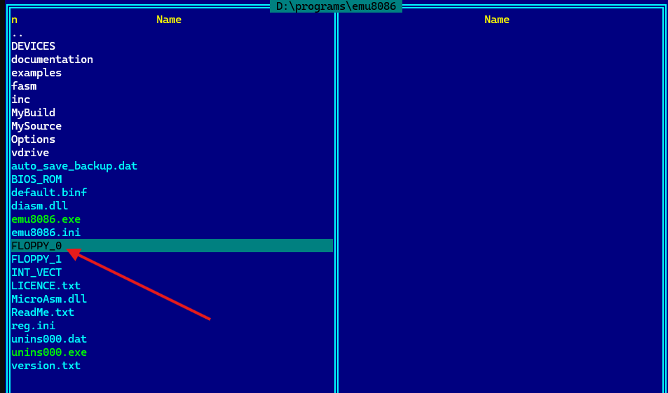
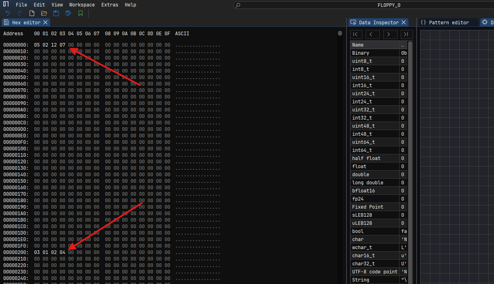
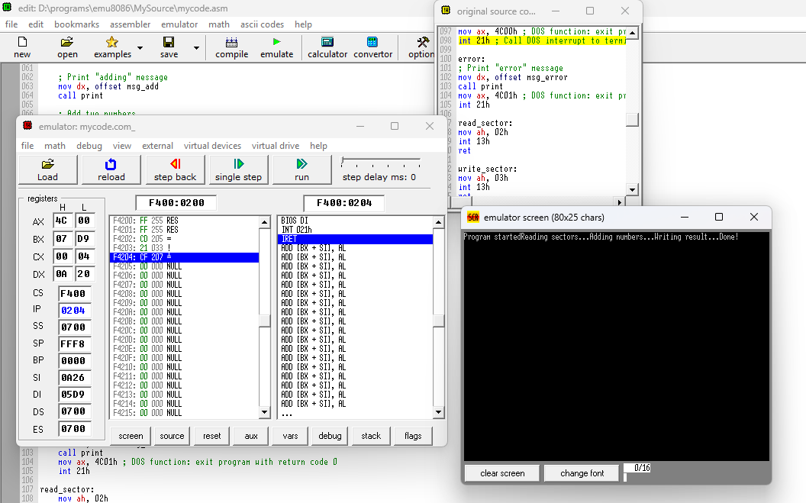
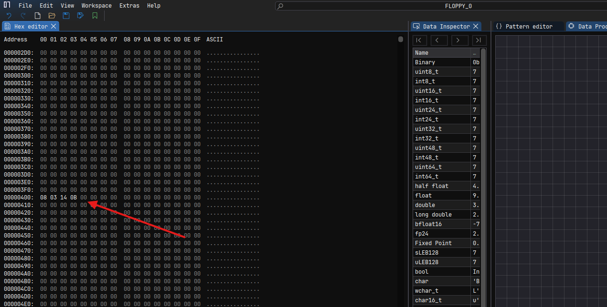

# Решение задачи "сложение в столбик"

1. Создание дискеты FLOPPY в emu8086.

2. Запись в файл FLOPPY для emu8086 двух чисел с помощью ImHex. Одно - в первый сектор (смещение 0), а второе - во второй (смещение 200).

3. Выполнение программы `mycode.asm`.

4. Контроль результата в третьем секторе FLOPPY.

