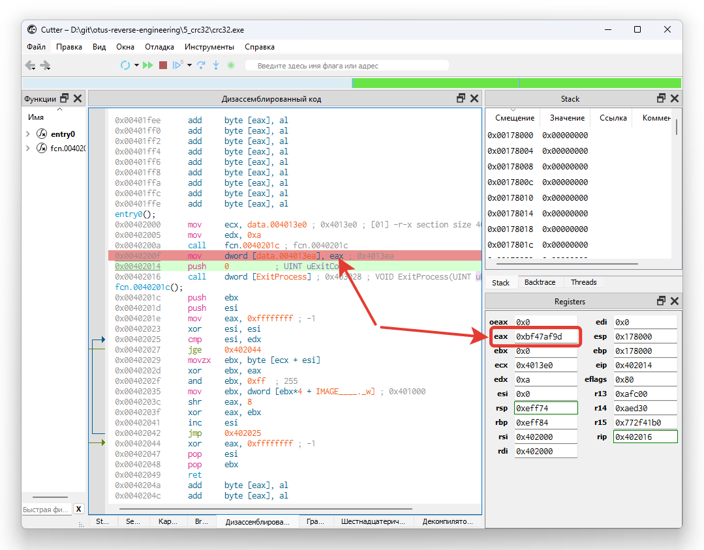

# Портирование программы с MIPS на x86

Исходная программа `crc32-mips.asm` портирована в версию x86, с возможностью сборки через FASM: `crc32-x86.asm`.

Результат расчета показан на скриншоте из отладчика в Cutter:

