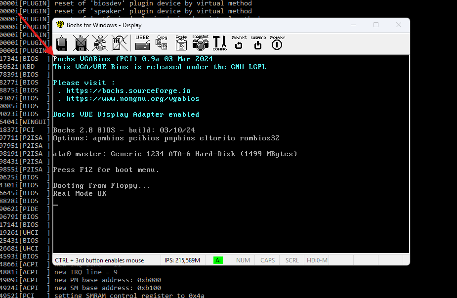

# Решение задачи на переход в защищенный режим процессора

Для решения задачи за основу взята программа и подход прошлой задачи #6 про MBR. Создан аналогичный загрузчик `main.asm`, который:

1. В реальном режиме выводит на экран надпись "Real Mode OK".
2. Переключает процессор в защищенный режим. Начиная с этого момента процессор декодирует инструкции как 32-битные команды.
3. В защищенном режиме выводит на экран символ "P" белого цвета на черном фоне с помощью прямой записи в видеопамять без использования BIOS-прерываний.

На скриншоте ниже пример вывода в эмуляторе Bochs. Символ "P" печатается в левом верхнем углу экрана, т.к. запись происходит по базовому адресу текстового видеоадаптера (смещение 0).

Если попробовать вызвать прерывание BIOS `int10h` сразу после вывода "P" (то есть в защищенном режиме), то загрузчик будет падать, вызывая бесконечный цикл загрузки в Bochs. Это тоже косвенно подтверждает успешный переход в защищенный режим.
