# Настройка рабочей среды для отладки драйверов режима ядра

По заданию требуется:
- Написать программу, которая загружает драйвер и передаёт ему ID процесса для завершения, а также реализовать сам драйвер, принимающий ID процесса и завершающий его.
- Научиться отлаживать драйверы.

Работал в два этапа: сначала настроил отладку ядра на шаблонном драйвере Terminator, а потом дописал драйвер и управляющее приложение по требованиям задания.

В качестве хостовой ОС используется Windows 11, а в качестве гостевой, которая будет отлаживаться - Windows 10 на Virtual Box.

1. Настроил COM-порт на виртуальной машине:

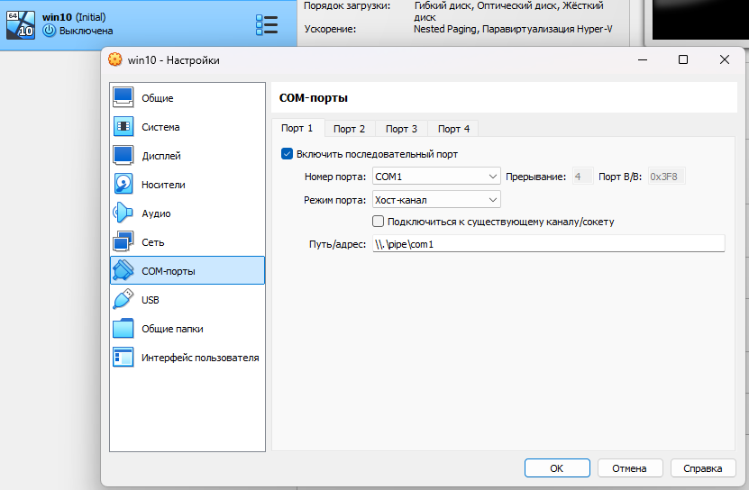

2. Запустил виртуальную машину и включил режим отладки для неподписанных драйверов (команды выполнять от имени администратора):

```cmd
bcdedit /debug on
bcdedit /dbgsettings serial debugport:1 baudrate:115200
bcdedit /set nointegritychecks on
bcdedit /set testsigning on
```

3. Выключил виртуальную машину и запустил WinDbg. В WinDbg включил ожидание на подключение к гостевой машине по настроенному COM-порту:

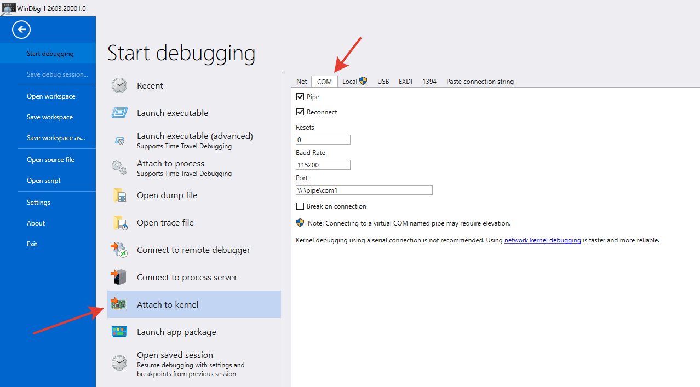

4. Запустил виртуальную машину. WinDbg сразу замечает запуск и подключается. _Здесь важна именно такая последовательность. Если запустить виртуалку до WinDbg, то виртуалка повиснет в ожидании отладчика и последующий запуск WinDbg уже не будет к ней подключаться._

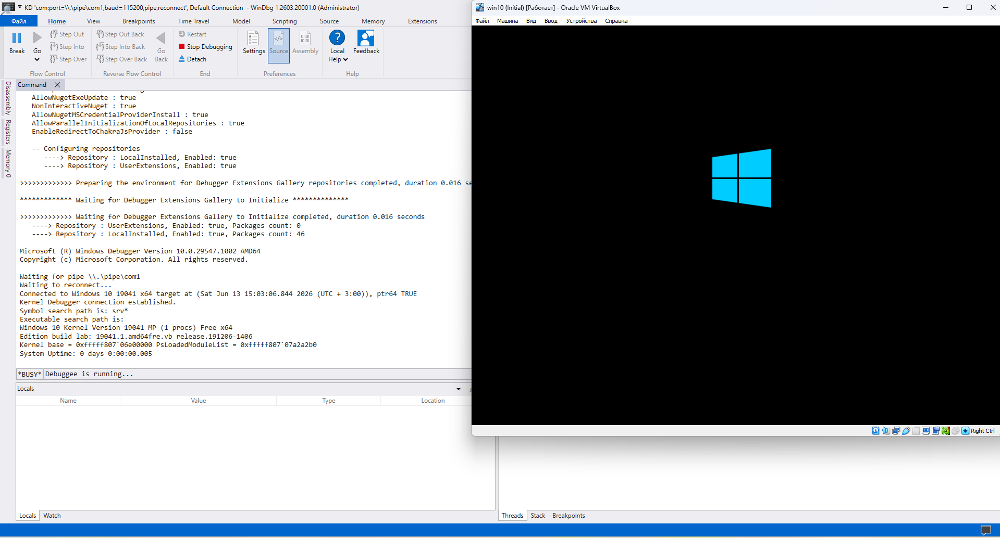

5. После загрузки гостевой ОС видим в правом нижнем углу, что включен тестовый режим

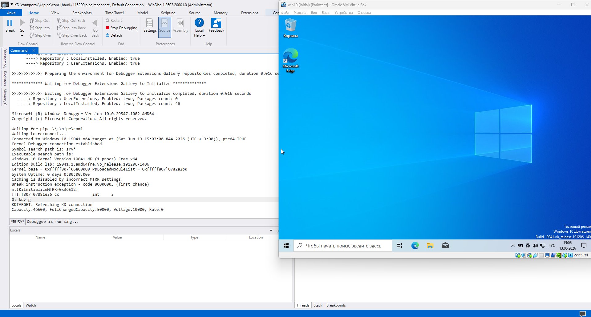

6. В Visual Studio собрал шаблонный драйвер и управляющее приложение.

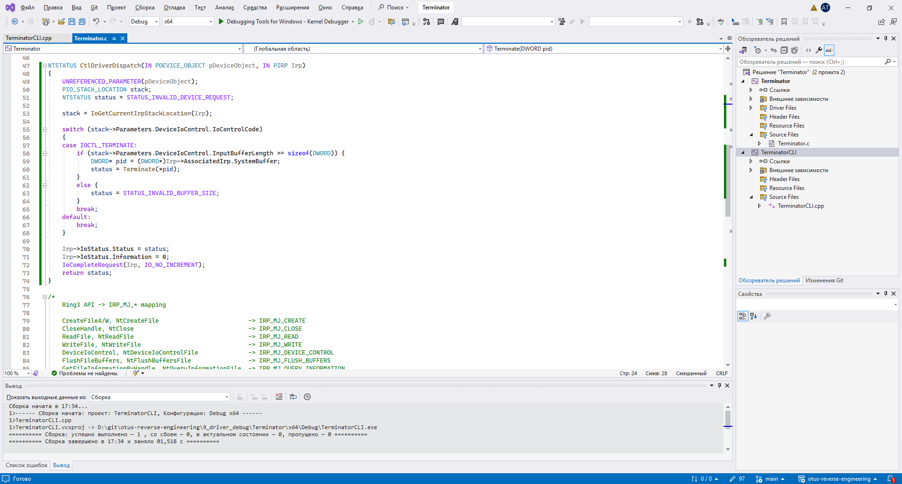

7. Сбросил на гостевую ОС собранные драйвер `Terminator.sys` и `TerminatorCLI.exe` и зарегистрировал драйвер через OSR Driver Loader. Драйвер появился в окне "Сведения о системе".

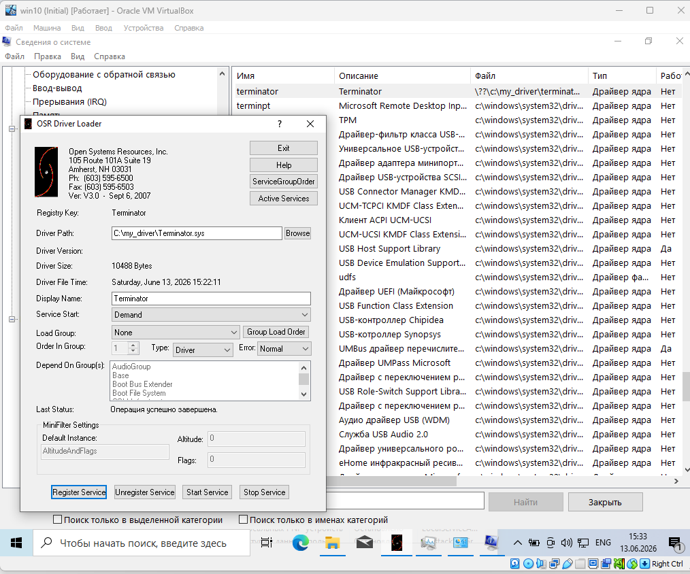

8. Запустил службу с драйвером. В окне "Сведения о системе" теперь видно, что драйвер работает.

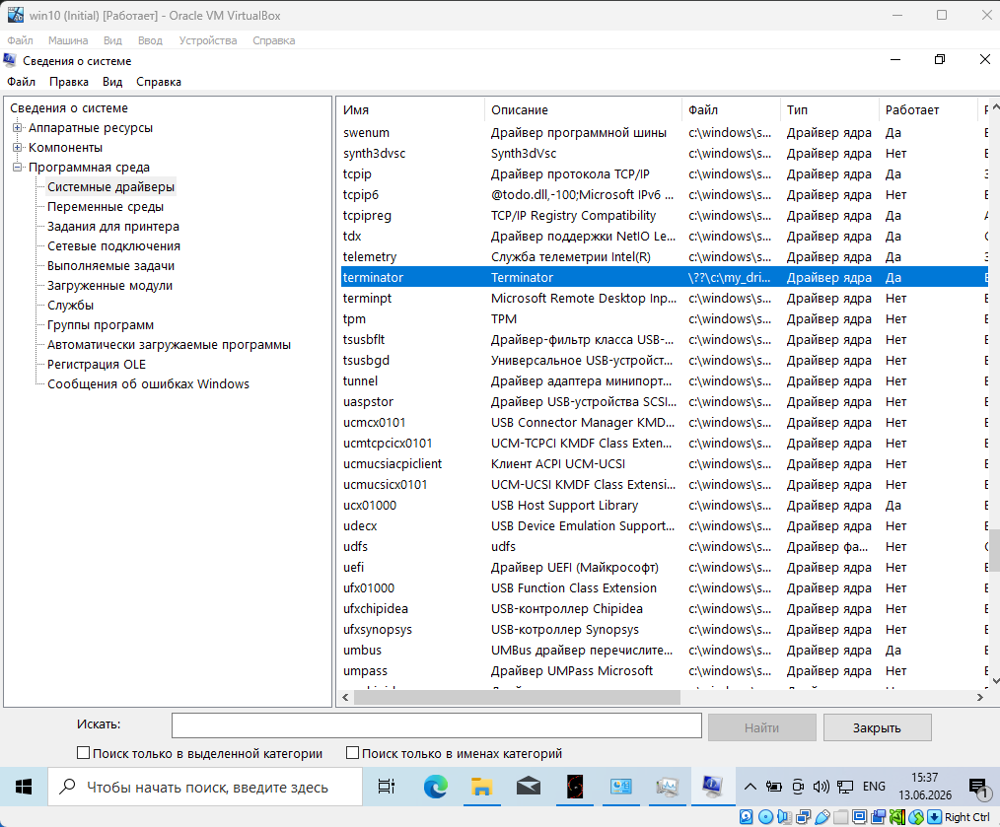

9. Проверил, что WinDbg видит функцию `Terminate()` и связывает ее с исходниками. Также установил точки останова на диспетчер и на саму функцию Terminate. _Здесь важно открыть файл с исходным кодом до подключения к виртуалке, иначе WinDbg не связывает его с функцией в памяти._

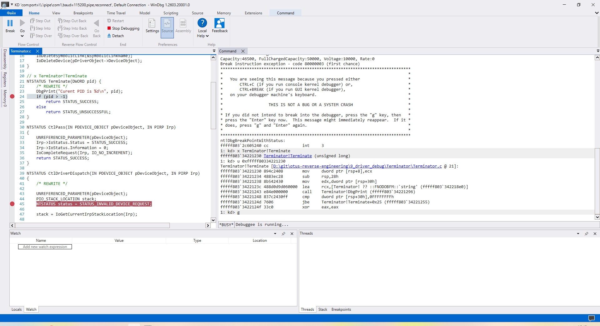

10. Запустил TerminatorCLI и WinDbg сразу остановился на первой точке останова.

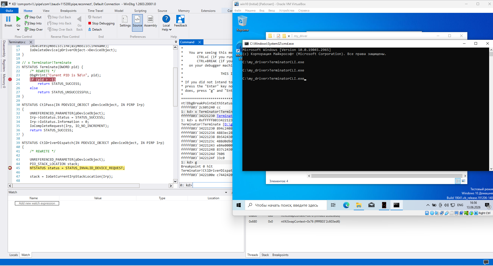

11. Прошел дальше и остановился на второй точке останова. Отладка настроена и работает.

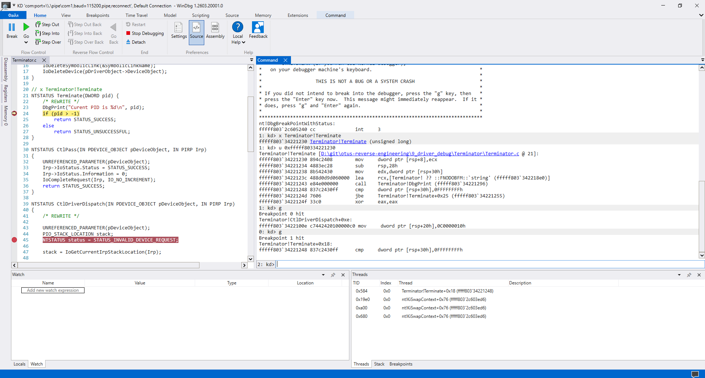

12. Дописал шаблонные драйвер и приложение, чтобы работало завершение процесса по PID-у. Исходный код приложен в репозитории.

13. Скопировал на виртуальную машину новые драйвер и приложение и перезагрузил драйвер.

14. Для эксперимента запустил "Блокнот" и попробовал завершить его по PID через TerminatorCLI.


15. "Блокнот" успешно завершился. Драйвер и приложение работают.

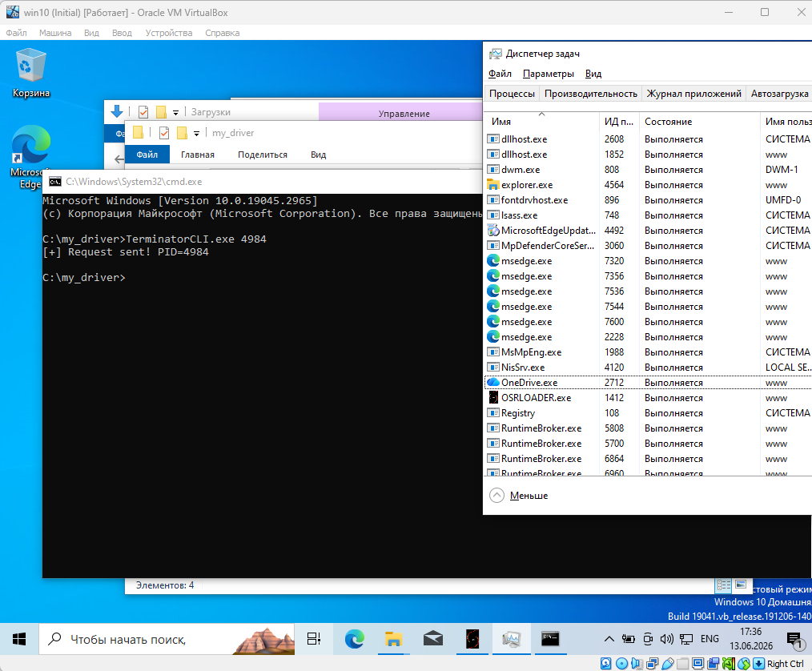
